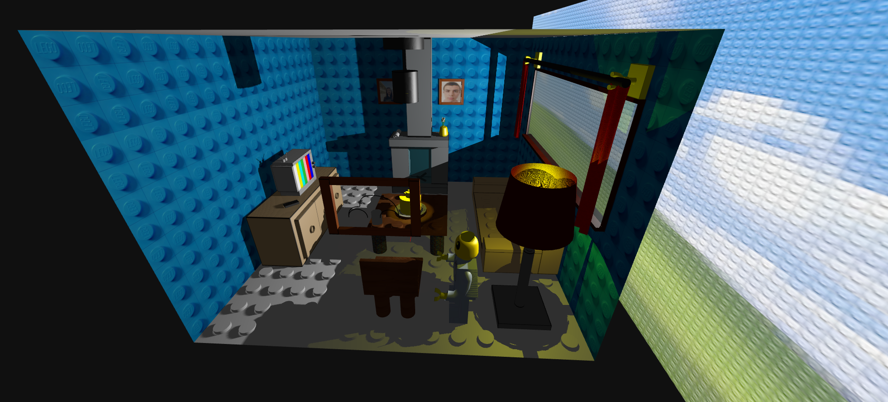
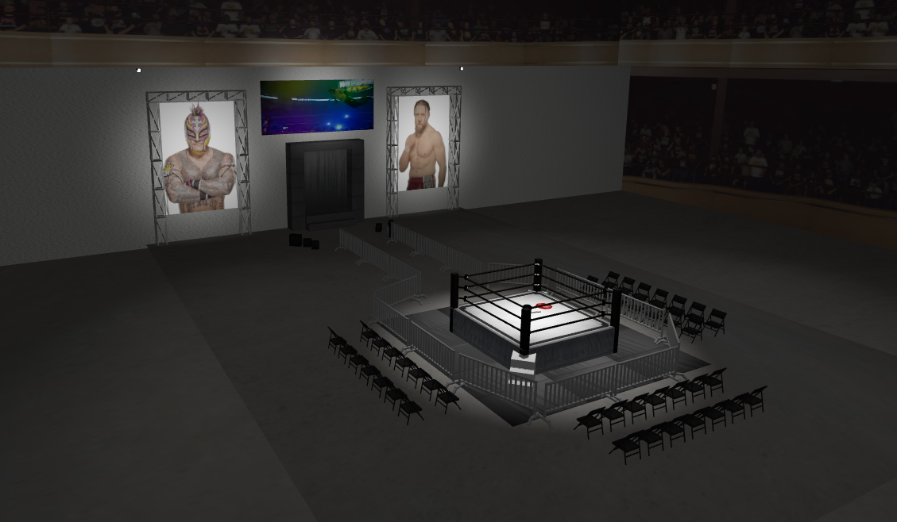

# ThreeJS Scenes

Project made for Interactive Graphics Systems (SGI) course @ FEUP - M.EIC 2024/2025

Grades:
- TP1: 19.5/20
- TP2: 18.7/20
- TP3: TBA/20

## Developed by Group T03xG05
| Name             | Number    | E-Mail             |
| ---------------- | --------- | ------------------ |
| João Miguel Vieira Cardoso         | 202108732 | up202108732@up.pt                |
| Tiago Ribeiro de Sá Cruz         | 202108810 | up202108810@up.pt                |

----

## Projects

### [TP1 - ThreeJS Basics - Lego Living Room](tp1)

- Strong Points
  - Quality Controlability: In order to make sure our scene runs on even less powerful computers, we added many GUI options to increase or decrease scene quality, such as: Shadow Map type, Shadow control (add or remove the casting and/or receiving of shadows), Light Shadow (if it can cast shadow to other objects or not) and Shadow Map size for each light.
  - Hierarchical Scene Organization: Created a custom MyEntity class to manage objects hierarchically, improving code organization and reusability.
  - Fun Theme: The scene is themed around Legos, with many objects like the floor, table, and cake designed around the Lego image. We also added a bunch of new Lego objects to fill the scene, adding a playful and creative touch to the environment.
  - Interactive Animations: Added interactive elements like opening and closing curtains and moving/rotating the Lego objects around, controlled through the GUI to add life to the scene.
- Scene
  - Our scene consists of a Lego living room, it is furnitured with the obligatory: Table, cake with a lit candle (candle + flame) on a plate and a spiral spring on said table, spotlight aimed at the cake, 2 painting on a wall with pictures of us, another painting with a beetle, a window, a newspaper and a jar with a flower. Besides this, we added: a sofa, a lamp, curtains, a tv stand, a tv, a fireplace, a chair and a Lego person.
  - [View the Scene](tp1/index.html)

  

-----

### [TP2 - Pro-Wrestling Indie Show](tp2)
- Strong Points
  - Adaptability: The scene is made out of a generic program that can parse through a correctly formatted json file and convert it's text into actual objects and contents in the scene. This approach allows for a lot of flexability and usability in the long term.
  - Hierarchical Scene Organization: Created a custom MyEntity class to manage objects hierarchically as they appear in the json file. This allows for many automatizations to be made so that the user can abstract the tasks more effectively.
  - Interesting Theme: The scene is themed around wrestling. More particularly, a small wrestling event run in a closed environment. This theme has many different entities that could be created and allows for many different types of lighting to be toggled.
- Scene
  - The scene consists of a wrestling event, with various objects that would make such a scenario, such as a complete wrestling ring, chairs for the audience, barricades, an entrance stage, a titatron to display the wrestler's entrance video and two video walls displaying either the wrestler's graphics (Rey Mysterio and Bryan Danielson). The ring has a broken STOP sign in the middle of it, giving off the vibe that a hardcore match has just happened.
  - [View the Scene](tp2/index.html)

  

----

### [TP3 - Island Balloon Racing Game](tp3)
- Main Strong Points
  - Use of instanced meshes to avoid lag with palm trees
  - Fun thematic opponents: Mario will do many up and downs to simulate his jumps. Luigi will stay on high altitude levels since he's very tall. Lego stays on low altitude levels, since lego pieces are usually small. Rey Mysterio during his route will change his altitude levels in the order 6-1-9, in a homage to his pro-wrestling finisher, the "619".
  - Detailed Particles: We developed many different particles that aid and improve our scene. We have fire particles inside the balloon, like a real life hot air balloon. If the balloon receives a penalty, smoke particles come from the top of the balloon, giving a visual aid to the penalty. Our fountain uses particles to mimic water running from it. Once the game ends, fireworks particles are displayed, giving the ending a festive feeling.
  - Lively scene: Besides the opponent balloon using keyframe animations, we also used them on a zeppelin which flies around the island in a circular motion. This gives more life to the scene making it look less static, especially during menus.
  - Different Cameras: We developed 3 types of cameras to provide the best gameplay for users. Both 1st and 3rd person camera's automatically move so that the user doesn't need to move it while also controlling the balloon. If more control is wanted, we also developed a Free Camera, that comes with extra controls such as 'tfgh' to move it around and arrows to rotate it. This gives a lot of control to the user so they may play like they prefer.
  - Easily Configurable: Using our CONFIG.js file, anyone can make the game easier/more difficult. Among other things to improve performance such as lod distance and display interval.
  - Usage of complex textures: In order to improve visuals without much cost, we used a lot of different types of textures, such as ao maps, bump maps and normal maps. This can be easily seen on the grass and the sand, for example.
- Scene
  - The scene of the game consists of an island designated for races. This island has many palm trees, two watch towers, two parking lots, a zeppelin flying in circles around the island, a fountain, obstacles, powerups, 2 displays, an hospital tent, a pier, two bleachers for the audience and 8 balloons in total.
  - We have 4 different balloons and they are: Mario, Luigi, Lego and Rey Mysterio. Both Lego and Rey Mysterio are homages to past SGI projects (tp1 and tp2 accordingly). Each balloon has their own route. Each route is similar, but varies on Y levels.
  - [View the Scene](tp3/index.html)

  

