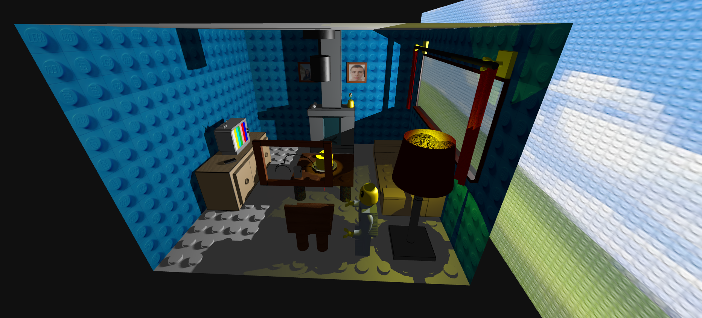

# SGI 2024/2025 - TP1

## Group T03xG05

| Name             | Number    | E-Mail             |
| ---------------- | --------- | ------------------ |
| João Miguel Vieira Cardoso         | 202108732 | up202108732@up.pt                |
| Tiago Ribeiro de Sá Cruz         | 202108810 | up202108810@up.pt                |
----
## Project information

This project's goal was to create a scene with some key elements, using THREE.js technology, such as geometries, transformations, materials, textures, curves, lines, and shadows. To make things creative, and due to the nature of the items that were tasked to be created, such as a table with a cake on it, we decided to theme our project as a Lego living room.

 Figure 1 - Living Roor Overview 

## Main Strong Points

- Quality Controlability: In order to make sure our scene runs on even less powerful computers, we added many GUI options to increase or decrease scene quality, such as: Shadow Map type, Shadow control (add or remove the casting and/or receiving of shadows), Light Shadow (if it can cast shadow to other objects or not) and Shadow Map size for each light.

- Hierarchical Scene Organization: Created a custom MyEntity class to manage objects hierarchically, improving code organization and reusability.

- Fun Theme: The scene is themed around Legos, with many objects like the floor, table, and cake designed around the Lego image. We also added a bunch of new Lego objects to fill the scene, adding a playful and creative touch to the environment.

- Interactive Animations: Added interactive elements like opening and closing curtains and moving/rotating the Lego objects around, controlled through the GUI to add life to the scene.

## Scene

As mentioned earlier, our scene consists of a Lego living room, it is furnitured with the obligatory: Table, cake with a lit candle (candle + flame) on a plate and a spiral spring on said table, spotlight aimed at the cake, 2 painting on a wall with pictures of us, another painting with a beetle, a window, a newspaper and a jar with a flower. Besides this, we added: a sofa, a lamp, curtains, a tv stand, a tv, a fireplace, a chair and a Lego person. Looking further into what've created:

 ### Room Structure:
  - Walls: Four walls constructed using plane geometries. The wall facing the camera is invisible to provide an unobstructed view inside the room. Since adding too much Lego objects would make the scene rather slow, especially on lesser computers, we opted to use a Lego texture that mimics the feeling. In order to further improve realism, we always placed objects withing said Lego limits to look like they are properly fitted.
  
  
  
 Figure 2 - Wall with Beetle correctly aligned in the legos 

  - Floor: The floor is composed of a plane and Lego blocks, creating a textured surface that fits the Lego theme. Every object placed on top of the floor is made in order to look like it's fitted.
  
  
  
 Figure 3 - Legos on the floor 

  - Ceiling: Constructed using a plane and placed on top of the walls.
  
  
  
 Figure 4 - Ceiling with different lights and shadows 

- ### Obligatory Objects
  - Table: Composed of a box for the board, cylinders for the legs and with added legos to keep theme consistency. The table is made in a way that it's legs always fit the floor when scaled or moved, also when items are added to it, they are either placed on top of a unnocupied lego or are fitted into the table.
  
  
  
 Figure 4 - Table with Spiral Spring and Cake on top of it 

  - Plate: Made with an open-ended cylinder and a circle fillin in the gap at the bottom.
  - Cake: The cake is designed to resemble a Lego head, created using 2 cylinders (on on top of the other) with adjusted thetaLength to simulate a missing slice. Planes are added to close the gaps of the geometry
  - Candle: Made of two cylinders representing the wax and the wick, using different materials to distinguish between them. It also has a small orange pointlight on the flame to mimic it being lit.
  - Flame: Created with 5 cylinders, resembling two cones with the circle connected in order to make it look like a Lego flame instead of an actual burning flame. 
  
  
  
 Figure 5 - Closer look on the cake, it's components and the slice gap 

  - Paintings: Made with a 4 boxes making the 4 sides of the painting frame and a plane to place the picture as a texture. Since the theme are legos, we didn't add any wire that would hang the paintings, but instead placed them in a way in the wall that looks like they are fitted, as mentioned earlier.
  
  

 Figure 6 - Both the paintings with our pictures 

  - Window: Created with boxes to mimic a window frame and a plane to represent the glass. The frame has a wooden texture and the glass a glass texture to improve realism. To incorporate this item with our theme, we placed it perfectly on the pieces of legos, so it fits right in. The landscape on the outside is made with a plane, with a texture of windows xp background made of legos. The material of the landscape isn't affected by light to improve realism.
  
  
  
 Figure 7 - Window looking at the landscape with the right curtain slightly closed 

  - Spotlight: Composed of box and cylinders for the exterior, with a sphere to represent the lightbulb. There's also a spotlight aiming downwards, since the spotlight is also pointing downwards. We also added a texture to make every component of the spotlight to look like a Lego piece.

  
  
 Figure 8 - Closer look at the spotlight 

  - A painting of a beetle: Created in the same way that of the paintings, but with a drawing of a beetle on top of it, made with bezier curves
  - Spiral Spring: Made with a CatmullRomCurve3 and used Line2 in order to increase the line width. We used a for loop to create the points, calculating the x and z coordinates using cosine and sine of the angle to form the circular motion, and incrementally increasing the y coordinate to add height, thereby creating the spiral shape.
  - Newspaper: Created using NURBS surfaces and used a similar algorithm of the one used in the spiral spring in order to shape the newspaper like a reed. The newspaper comes with a newspaper-like texture with a Lego themed news article.
  
  
  
 Figure 9 - Closer look at the newspaper 

  - Jar: The jar was made using NURBS surfaces to model its curved shape. Control points are defined to build the bottom and top parts, allowing for smooth transitions between different radius. It also has a the texture of a Lego head to maintain the theme.
  - Flower: Composed of a line, a tube, a sphere, a circle, a box and a cylinder. The stem's texture is composed of mini-Lego blocks, making it look like it was made of Lego and, instead of real life petals, we used box with a cylinder on top, mimicing a Lego block.

  
  
 Figure 10 - Closer look at the jar and the flower 

- ### Extra Objects
  - Sofa: Created using 2 different cylinder geometries, one open-ended and the other only with PI/2 of length and a box. Legos were also added on the sit to improve Lego likeness to the scene. Every component uses a lego texture to look like it was made of Legos.
  - Lamp: The lamp consists of a base, 2 poles, a lightbulb, and a lampshade. Cylinders form the poles and base, while the lampshade is created using modified cylinder geometries. The bulb is modeled with a sphere and a modified cylinder, and a light source is placed inside to illuminate the scene. Details like connectors and screws are added to enhance realism. The base was made in order to appear like it's fitted on the floor, along with a texture that makes every component look like a lego piece.

  
  
 Figure 11 - An overall look at the Sofa and Lamp 

  - Curtains: The curtains were composed of an handle, which was itself composed with boxes, cylinders, circles and torus, made to look like a lego hand holding a rod (cylinder) and, the curtains themselves used nurbs surfaces, we also added some extra points along the middle of the curtain to make some slight random changes to simulate fabric curl. In the GUI we also added an option to close or open the curtains, which when combined with shadows adds an unique liveness to the scene.
  - TV Stand: Made of a big box geometry to simulate the main structure with 3 smaller boxes to simulate drawers. Each of the drawers has an open-ended cylinder in the middle of it to simulate a Lego drawer. Like many other objects, every component has a Lego texture to simulate Lego parts. This is also strategically placed on top of the floor's legos to mimic being fitted.
  - TV Remote: A small rectangular box with 2 different materials, one with a texture of a Lego remote and another without texture, but with the same color.
  - TV: Made with boxes, cylinders and spheres. The television monitor has different boxes with different materials.

  
  
 Figure 12 - An overall look of the TV Stand, the Remote and the TV itself 

  - Fireplace: Created with boxes for the structure, a plane for the protecting glass and cylinders for the logs. We added a newspaper and a jar with a flower on top of it to improve the decoration on the scene. Like many other objects, it uses a lego texture to mimic lego pieces and it's placed in a way on the floor it looks like it's fitted in

  
  
 Figure 13 - An overall look of the fireplace 

  - Chair: Similar to the table, but with an extra box to serve as the back rest.
  - Lego person: Created using several geometries. Box geometry was used for the shoes, pants, waist and hand pulses. Cylinder geometry was used for the crouch area, palm of the hands, neck and top of head. A Cylinder with different radius on the top and bottom faces and with only 4 radial segments compose the torso. Additional geometries were included to fill the sleeve gap of the arms and another one to place in front of the torso so that a texture could be placed without affecting the other sides of the torso.

  
  
  
 Figure 14 - An overall look at the Lego Person and the Chair

  ### [View the Scene](index.html)
## Issues/Problems

- GUI Synchronization:
  - Certain GUI controls won't update in real-time with scene changes, such as adding shadows to the whole room, but such change not being represented on the GUI of entities which were created without shadows on.
  