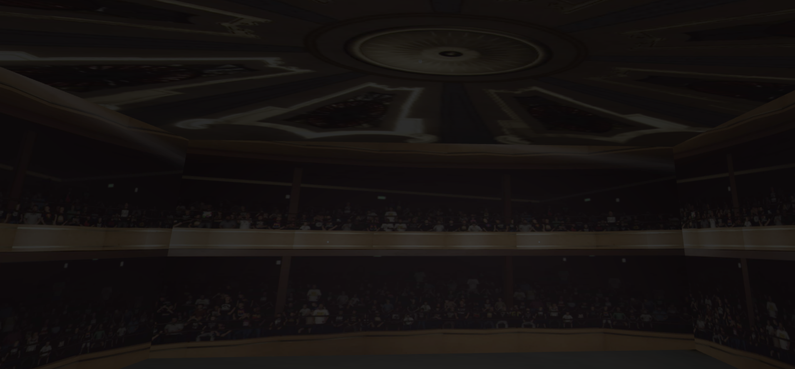

# SGI 2024/2025 - TP2

## Group T03xG05

| Name             | Number    | E-Mail             |
| ---------------- | --------- | ------------------ |
| João Miguel Vieira Cardoso         | 202108732 | up202108732@up.pt                |
| Tiago Ribeiro de Sá Cruz         | 202108810 | up202108810@up.pt                |
----
## Project information

This project's goal was to create a system that is able to generate a scene given a specified json style format file (yasf) which contains all it's contents.

 Figure 1 - Wrestling Arena Overview 

## Main Strong Points

- Adaptability: The scene is made out of a generic program that can parse through a correctly formatted json file and convert it's text into actual objects and contents in the scene. This approach allows for a lot of flexability and usability in the long term.
- Hierarchical Scene Organization: Created a custom MyEntity class to manage objects hierarchically as they appear in the json file. This allows for many automatizations to be made so that the user can abstract the tasks more effectively.
- Interesting Theme: The scene is themed around wrestling. More particularly, a small wrestling event run in a closed environment. This theme has many different entities that could be created and allows for many different types of lighting to be toggled.

## Scene

The scene consists of a wrestling event, with various objects that would make such a scenario, such as a complete wrestling ring, chairs for the audience, barricades, an entrance stage, a titatron to display the wrestler's entrance video and two video walls displaying either the wrestler's graphics (Rey Mysterio and Bryan Danielson). The ring has a broken STOP sign in the middle of it, giving off the vibe that a hardcore match has just happened.

In order to make the scene we applied many different strategies to improve realism and quality. Mipmaps were used in the making of the turnbuckle pads in the corner of the ring. LODs were used for every cylinder in the scene, the rings apron, the stage curtain and the chair's design. A video texture was applied to the titantron, where the titantron entrance video of a wrestler (Rey Mysterio) can be viewed. Buffer geometry was used to make the stop sign. Bump textures were applied in the ring steps in order for the steel bumps to look like they're coming out. In addition to that, we used wireframe materials for the grid around the wrestler graphics. Our scene also uses realistic lighting, illuminating slightly the whole scene, while mainting the bigger focus on the ring with a stronger light pointing directly towards it.
Finally, the scene can also be toggled with shadows and/or with wireframe by the GUI.

 ### Wrestling Section:
 
  - Ring: The ring consists of boxes (ring posts, ring mat and steps), cylinders (turnbuckle connectors), spheres (turnbuckle pads), planes (ring apron when distant from the ring, using lods) and nurbs (ring apron when closer to the ring, using lods).

  - Chairs: The chairs were made by combining cylinders and box geometries for the legs and seat respectively. For the back rest, a LOD was applied in order to view a nurb like round shape when closeby and just a basic box when sufficiently far away. The chairs were then organized by chair rows and then audience rows, and multiplied around the ring.

  - Barricades: The ring is surrounded by barricades, made out of cylinders. They are grouped together into barricade groups, which allowed to put more than one barricade at a time, significantly improving the speed of the implementation.

  
  
 Figure 2 - Wrestling Ring with chairs and barricades around it 

  - Stop Sign: At the middle of the ring there is a stop sign, which was made using a cylinder for the handle and a polygon with 8 slices in order to simulate an octagon. The polygon was entirely made using a buffer geometry which allowed for faster rendering speeds.

  
  
 Figure 3 - Stop Sign made out of a polygon 

  - Steps: There are 2 steps located in 2 of the corners of the ring. These steps were made out of box geometries. However, they present bump textures which makes it feel like the steel is popping out from it's geometry.

  
  
 Figure 4 - Steps with Bump Textures 

  
  - Titantron: A big TV that is displaying an introduction of a wrestler by using a Video Texture on a loop. The tv was built using a rectangle and the video was dynamically added to the html.

  - Video Walls: Two video walls with the wrestler's renders. It has two planes, one with an untextured emissive material and the other with a transparent png render of a wrestler.

  - Grids: There is grid shaped objects around the video walls, that use a wireframe material. The grids are made out of several box geometries.
  
  
  
 Figure 5 - Entrance of the Arena 

  - Curtains: Like the apron, the curtains are built using LODs in order to, when distant it's just a plane, but when close by it changes to a slightly curved nurb in order to look like a real curtain.
  
  - Lamps: Lamps with various sizes that are placed throughout the arena in order to light up the place and populate the scene. These lamps are composed of a box and a plane, where a spotlight is located at pointing outside from it. The lamps at the entrance are turned off, as if no wrestler is there right now, but the lights around the arena are turned on, using an emissive material.

  - Skybox: A skybox was also added in order to provide for background to the scene. The sides of the skybox consist of the same audience texture for the illusion of a crowd participating in the scene. The skybox is meant to represent the Hammerstein Ballroom Arena, an iconic venue known for it's ECW (Extreme Championship Wrestling) shows.

  
  
 Figure 6 - Skybox 

- ### Obligatory Objectives
  - Scene Graph: In order to parse the json file, a scene graph was developed. Since the json file is made out of hierarchical descendancies and parents, then the graph must adapt to that behaviour as well. The graph turned into an hierarchical graph where the root node is visited and then each child node is visited and so on. Transformations and inheritance of properties are all handled correctly and in the same MyEntity class which is responsable to guarantee these rules.

  - Level of Detail: There are several LODs being applied, since it improves the performance of the scene. The main LOD being applied is one that switched all the cylinders in the scene into boxes, since boxes contain less vertices than a cylinder. However due, to practical issues arising the concern of switching between LOD geometries too often the distance for when this is applied is very long. LODs are also applied to remove the nurbs structure from the chair, apron, as well as some other geometries, when the camera is too far away.

  - Advanced Textures: Applied a skybox to the scene, mip maps are also implemented on the pads of the rings, bump textures on the steps of the ring and video-texture is also present in the titantron located at the entrance of the scene.
  
  - Wireframe Visualisation: Like mentioned before, wireframe are applied to the grid objects around the video walls.

  - Buffer Geometry: The graph handles the construction directly in buffer geometry for geometries like triangles and polygons. There is a polygon in the scene which is used to represent the stop sign.

  - Level and quality of scene control: In the interface the user can toggle wireframe mode into all the objects in the scene and/or toggle shadows to appear on all objects that are able to emit and/or receive shadows.

  ### [View the Scene](index.html)
## Issues/Problems

- Performance:
  - The performance of the scene is noticeably very low. The cause of this is mainly unknown, but recent discoveries were made that indicated the scene was creating too much entities, especially the THREE.js group object. This happens due to the organization that is forced to be made in terms to the yasf format that is intended to be followed. After unnesting some entities the performance went up, but we didn't manage to remove all the lag of the scene, despite it's low number of triangles. This happens particuraly in our scene due to the number of replications made (namely in the barricades and the chairs). A way to fix this could be to replace the meshes with InstancedMesh from ThreeJS.

