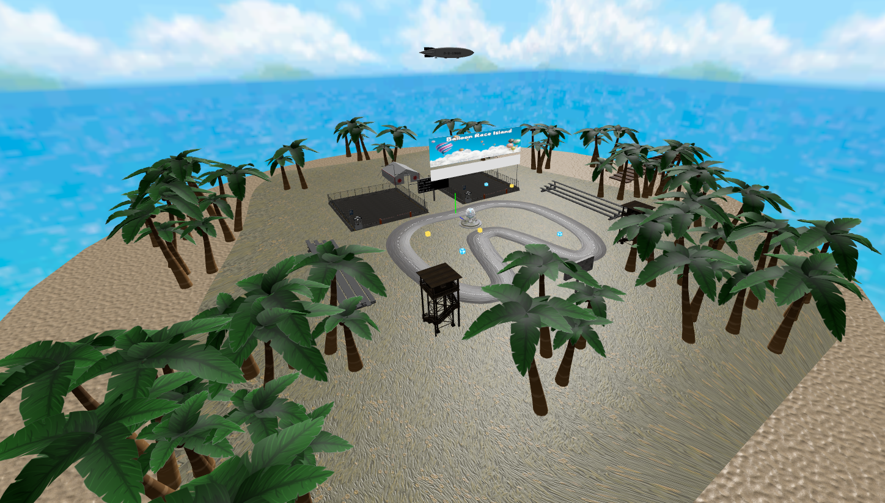
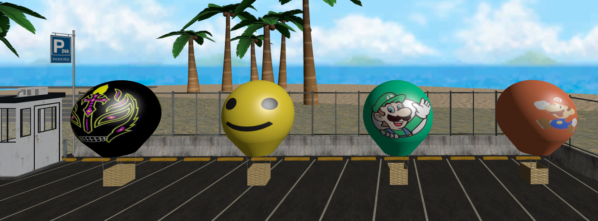
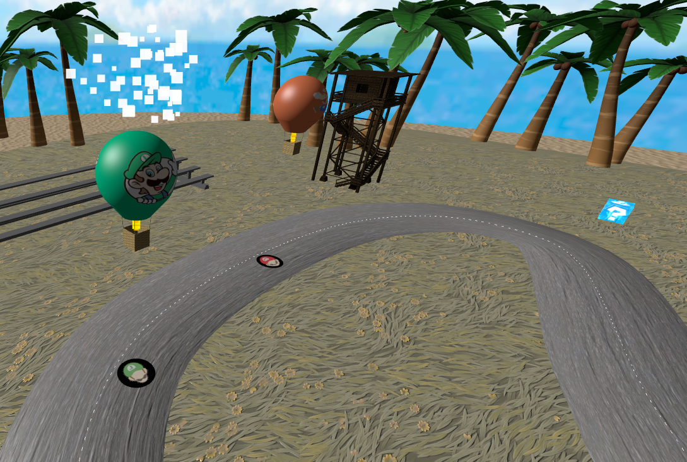

# SGI 2024/2025 - TP3

## Group T03xG05

| Name             | Number    | E-Mail             |
| ---------------- | --------- | ------------------ |
| João Miguel Vieira Cardoso         | 202108732 | up202108732@up.pt                |
| Tiago Ribeiro de Sá Cruz         | 202108810 | up202108810@up.pt                |

----
## Project information

- Main Strong Points
  - Use of instanced meshes to avoid lag with palm trees
  - Fun thematic opponents: Mario will do many up and downs to simulate his jumps. Luigi will stay on high altitude levels since he's very tall. Lego stays on low altitude levels, since lego pieces are usually small. Rey Mysterio during his route will change his altitude levels in the order 6-1-9, in a homage to his pro-wrestling finisher, the "619".
  - Detailed Particles: We developed many different particles that aid and improve our scene. We have fire particles inside the balloon, like a real life hot air balloon. If the balloon receives a penalty, smoke particles come from the top of the balloon, giving a visual aid to the penalty. Our fountain uses particles to mimic water running from it. Once the game ends, fireworks particles are displayed, giving the ending a festive feeling.
  - Lively scene: Besides the opponent balloon using keyframe animations, we also used them on a zeppelin which flies around the island in a circular motion. This gives more life to the scene making it look less static, especially during menus.
  - Different Cameras: We developed 3 types of cameras to provide the best gameplay for users. Both 1st and 3rd person camera's automatically move so that the user doesn't need to move it while also controlling the balloon. If more control is wanted, we also developed a Free Camera, that comes with extra controls such as 'tfgh' to move it around and arrows to rotate it. This gives a lot of control to the user so they may play like they prefer.
  - Easily Configurable: Using our CONFIG.js file, anyone can make the game easier/more difficult. Among other things to improve performance such as lod distance and display interval.
  - Usage of complex textures: In order to improve visuals without much cost, we used a lot of different types of textures, such as ao maps, bump maps and normal maps. This can be easily seen on the grass and the sand, for example.

- Scene
  - The scene of the game consists of an island designated for races. This island has many palm trees, two watch towers, two parking lots, a zeppelin flying in circles around the island, a fountain, obstacles, powerups, 2 displays, an hospital tent, a pier, two bleachers for the audience and 8 balloons in total.
  - We have 4 different balloons and they are: Mario, Luigi, Lego and Rey Mysterio. Both Lego and Rey Mysterio are homages to past SGI projects (tp1 and tp2 accordingly). Each balloon has their own route. Each route is similar, but varies on Y levels.
  - Initial State 
  
  - Balloons 
  
  - Playing (after a collision happened) 
  
  - Final Menu
  |
  - [View the Scene](index.html)

----
## Issues/Problems

- If we leave the tab of the game or the browser itself, time will keep counting, but eveerything else will stop. This leads to an innacurate representation of time passed.
- If a user is playing in 1st person, they might not realize they've hit an object and are penalized without them fully understanding why at the exact moment
- A warning regarding lazy initialization is sometimes displayed, but we did not understand what was causing it
- Due to the spritesheet not having all letters centered, some appear slightly offcentered, this is easily viewed with the letter 'i'

